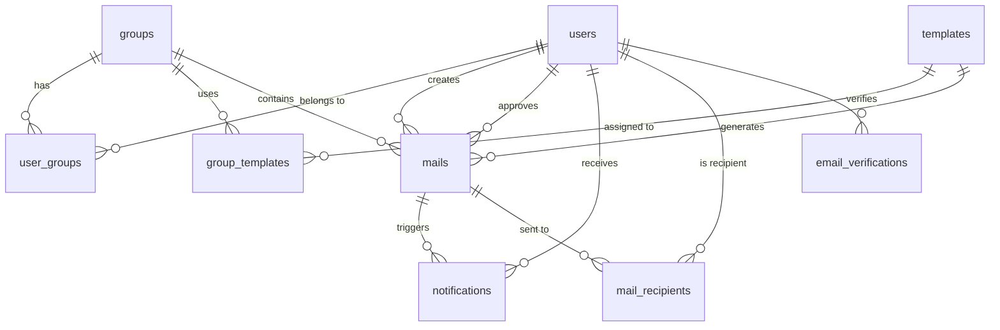

# Database Schema Design

> PostgreSQL database schema for the Mailer Agent application.

---

## 1. Entity-Relationship Overview



---

## 2. Enums

### 2.1 `global_role_enum`

System-wide roles. These determine platform-level permissions.

```sql
CREATE TYPE global_role_enum AS ENUM ('user', 'admin', 'owner', 'root');
```

**Hierarchy (ascending):** `user` < `admin` < `owner` < `root`

> [!NOTE]
> There is no `moderator` at global level. Moderation is a group-specific concept.

---

### 2.2 `group_role_enum`

Per-group roles. These determine what a user can do within a specific group.

```sql
CREATE TYPE group_role_enum AS ENUM ('user', 'moderator', 'admin', 'owner', 'root');
```

**Hierarchy (ascending):** `user` < `moderator` < `admin` < `owner` < `root`

> [!IMPORTANT]
> **Role inheritance rule:** Users with global roles `admin`, `owner`, or `root` automatically hold that same role (or higher) in every group. Their `user_groups.role` is effectively `MAX(user_groups.role, users.global_role)` — the global role acts as a **floor**, not a ceiling.
>
> A global `user` can be promoted to `moderator` or `admin` for a specific group via `user_groups.role`.

---

### 2.3 `auth_provider_enum`

```sql
CREATE TYPE auth_provider_enum AS ENUM ('email', 'google');
```

---

### 2.4 `mail_status_enum`

```sql
CREATE TYPE mail_status_enum AS ENUM ('draft', 'pending_approval', 'approved', 'rejected', 'sent');
```

**State transitions:**

```
draft → pending_approval → approved → sent
                         → rejected → draft (re-editable)
```

---

### 2.5 `notification_type_enum`

```sql
CREATE TYPE notification_type_enum AS ENUM (
  'approval_requested',
  'mail_approved',
  'mail_rejected',
  'mail_sent',
  'added_to_group',
  'removed_from_group',
  'role_changed'
);
```

---

## 3. Tables

### 3.1 `users`

Stores all registered users. Created on email registration or first Google OAuth login.

| Column | Type | Constraints | Notes |
|---|---|---|---|
| `id` | `UUID` | PK, `gen_random_uuid()` | |
| `email` | `VARCHAR(320)` | UNIQUE, NOT NULL | Login email |
| `name` | `VARCHAR(255)` | NOT NULL | Display name |
| `avatar_url` | `TEXT` | NULLABLE | Profile picture URL |
| `password_hash` | `TEXT` | NULLABLE | bcrypt hash; NULL for Google-only users |
| `provider` | `auth_provider_enum` | NOT NULL | Primary registration method |
| `google_id` | `VARCHAR(255)` | UNIQUE, NULLABLE | Google sub claim; set on OAuth link |
| `email_verified` | `BOOLEAN` | NOT NULL, DEFAULT `FALSE` | Verified via email link |
| `global_role` | `global_role_enum` | NOT NULL, DEFAULT `'user'` | System-wide role |
| `is_active` | `BOOLEAN` | NOT NULL, DEFAULT `TRUE` | Soft-disable account |
| `created_at` | `TIMESTAMPTZ` | NOT NULL, DEFAULT `NOW()` | |
| `updated_at` | `TIMESTAMPTZ` | NOT NULL, DEFAULT `NOW()` | Auto-updated via trigger |

**Indexes:**
- `idx_users_email` — UNIQUE on `email`
- `idx_users_google_id` — UNIQUE on `google_id` (partial, WHERE NOT NULL)
- `idx_users_global_role` — on `global_role`

> [!NOTE]
> **Email registration:** `provider = 'email'`, `password_hash` is set, `email_verified = FALSE` until link clicked.
> **Google OAuth:** `provider = 'google'`, `password_hash` is NULL, `google_id` is set, `email_verified = TRUE` (Google already verified).
> **Account linking:** An email-registered user can later connect Google by populating `google_id`. They can then log in via either method.

---

### 3.2 `email_verifications`

Tokens for verifying email addresses (click-to-verify flow).

| Column | Type | Constraints | Notes |
|---|---|---|---|
| `id` | `UUID` | PK, `gen_random_uuid()` | |
| `user_id` | `UUID` | FK → `users.id`, ON DELETE CASCADE | |
| `token` | `VARCHAR(255)` | UNIQUE, NOT NULL | URL-safe random token |
| `expires_at` | `TIMESTAMPTZ` | NOT NULL | Token expiry (e.g. 24h) |
| `used_at` | `TIMESTAMPTZ` | NULLABLE | Set when token is consumed |
| `created_at` | `TIMESTAMPTZ` | NOT NULL, DEFAULT `NOW()` | |

**Indexes:**
- `idx_email_verifications_token` — UNIQUE on `token`
- `idx_email_verifications_user_id` — on `user_id`

---

### 3.3 `groups`

A collaborative workspace containing templates and mails.

| Column | Type | Constraints | Notes |
|---|---|---|---|
| `id` | `UUID` | PK, `gen_random_uuid()` | |
| `name` | `VARCHAR(255)` | NOT NULL | Group display name |
| `description` | `TEXT` | NULLABLE | Optional description |
| `created_by` | `UUID` | FK → `users.id`, NOT NULL | Admin who created it |
| `created_at` | `TIMESTAMPTZ` | NOT NULL, DEFAULT `NOW()` | |
| `updated_at` | `TIMESTAMPTZ` | NOT NULL, DEFAULT `NOW()` | |

**Indexes:**
- `idx_groups_created_by` — on `created_by`

---

### 3.4 `user_groups` (join table)

Many-to-many: users ↔ groups, with a **per-group role**.

| Column | Type | Constraints | Notes |
|---|---|---|---|
| `user_id` | `UUID` | FK → `users.id`, ON DELETE CASCADE | |
| `group_id` | `UUID` | FK → `groups.id`, ON DELETE CASCADE | |
| `role` | `group_role_enum` | NOT NULL, DEFAULT `'user'` | Explicitly assigned group role |
| `joined_at` | `TIMESTAMPTZ` | NOT NULL, DEFAULT `NOW()` | |

**Primary Key:** `(user_id, group_id)`

**Indexes:**
- `idx_user_groups_group_id` — on `group_id` (for "list members of group")
- `idx_user_groups_role` — on `role` (for "find moderators/admins in group")

> [!IMPORTANT]
> **Effective group role** = `MAX(user_groups.role, users.global_role)` (mapped to group role ordinals).
>
> - Global `root`/`owner`/`admin` → always at least that role in every group
> - Global `user` + group `moderator` → effective group role is `moderator`
> - Global `admin` + group `user` → effective group role is `admin`
>
> The `user_groups.role` column stores the *explicitly assigned* group role. Application code computes the effective role at query time.

---

### 3.5 `templates`

A reusable email template with a prompt and fillable fields.

| Column | Type | Constraints | Notes |
|---|---|---|---|
| `id` | `UUID` | PK, `gen_random_uuid()` | |
| `name` | `VARCHAR(255)` | NOT NULL | Template display name |
| `description` | `TEXT` | NULLABLE | What this template is for |
| `prompt` | `TEXT` | NOT NULL | LLM prompt with `{{field}}` placeholders |
| `fields` | `JSONB` | NOT NULL | Array of field definitions (see below) |
| `created_by` | `UUID` | FK → `users.id`, NOT NULL | Moderator/admin who created it |
| `created_at` | `TIMESTAMPTZ` | NOT NULL, DEFAULT `NOW()` | |
| `updated_at` | `TIMESTAMPTZ` | NOT NULL, DEFAULT `NOW()` | |

**Indexes:**
- `idx_templates_created_by` — on `created_by`

**`fields` JSONB structure:**

```json
[
  {
    "key": "recipient_name",
    "label": "Recipient Name",
    "type": "text",
    "required": true,
    "placeholder": "e.g. John Doe"
  },
  {
    "key": "tone",
    "label": "Tone",
    "type": "select",
    "required": true,
    "options": ["formal", "casual", "friendly"]
  }
]
```

Supported field types: `text`, `textarea`, `select`, `multiselect`, `number`, `date`.

---

### 3.6 `group_templates` (join table)

Many-to-many: groups ↔ templates.

| Column | Type | Constraints | Notes |
|---|---|---|---|
| `group_id` | `UUID` | FK → `groups.id`, ON DELETE CASCADE | |
| `template_id` | `UUID` | FK → `templates.id`, ON DELETE CASCADE | |
| `added_by` | `UUID` | FK → `users.id`, NOT NULL | Who linked it |
| `added_at` | `TIMESTAMPTZ` | NOT NULL, DEFAULT `NOW()` | |

**Primary Key:** `(group_id, template_id)`

---

### 3.7 `mails`

An email draft/sent item within a group.

| Column | Type | Constraints | Notes |
|---|---|---|---|
| `id` | `UUID` | PK, `gen_random_uuid()` | |
| `group_id` | `UUID` | FK → `groups.id`, NOT NULL | Parent group |
| `template_id` | `UUID` | FK → `templates.id`, NOT NULL | Source template |
| `created_by` | `UUID` | FK → `users.id`, NOT NULL | Author |
| `approved_by` | `UUID` | FK → `users.id`, NULLABLE | Approver (null until approved) |
| `subject` | `VARCHAR(998)` | NOT NULL | Email subject line |
| `body_original` | `TEXT` | NOT NULL | LLM-generated body (immutable) |
| `body_final` | `TEXT` | NOT NULL | Edited body (for diff display) |
| `field_values` | `JSONB` | NOT NULL | Snapshot of filled field values |
| `additional_info` | `TEXT` | NULLABLE | Extra user-provided context |
| `status` | `mail_status_enum` | NOT NULL, DEFAULT `'draft'` | Current state |
| `approved_at` | `TIMESTAMPTZ` | NULLABLE | When approved |
| `sent_at` | `TIMESTAMPTZ` | NULLABLE | When actually sent |
| `created_at` | `TIMESTAMPTZ` | NOT NULL, DEFAULT `NOW()` | |
| `updated_at` | `TIMESTAMPTZ` | NOT NULL, DEFAULT `NOW()` | |

**Indexes:**
- `idx_mails_group_id` — on `group_id`
- `idx_mails_created_by` — on `created_by`
- `idx_mails_status` — on `status`
- `idx_mails_group_status` — on `(group_id, status)` (common filter)

---

### 3.8 `mail_recipients`

Recipients for a mail. Each recipient is an existing user in the system.

| Column | Type | Constraints | Notes |
|---|---|---|---|
| `id` | `UUID` | PK, `gen_random_uuid()` | |
| `mail_id` | `UUID` | FK → `mails.id`, ON DELETE CASCADE | |
| `user_id` | `UUID` | FK → `users.id`, ON DELETE CASCADE | Recipient (must be a registered user) |
| `recipient_type` | `VARCHAR(3)` | NOT NULL, DEFAULT `'to'` | `to`, `cc`, or `bcc` |

**Unique constraint:** `(mail_id, user_id, recipient_type)`

**Indexes:**
- `idx_mail_recipients_mail_id` — on `mail_id`
- `idx_mail_recipients_user_id` — on `user_id`

---

### 3.9 `notifications`

In-app notifications for approval requests and status updates.

| Column | Type | Constraints | Notes |
|---|---|---|---|
| `id` | `UUID` | PK, `gen_random_uuid()` | |
| `user_id` | `UUID` | FK → `users.id`, ON DELETE CASCADE | Recipient |
| `mail_id` | `UUID` | FK → `mails.id`, ON DELETE CASCADE, NULLABLE | Related mail |
| `group_id` | `UUID` | FK → `groups.id`, ON DELETE CASCADE, NULLABLE | Related group |
| `type` | `notification_type_enum` | NOT NULL | |
| `title` | `VARCHAR(255)` | NOT NULL | Short summary |
| `message` | `TEXT` | NULLABLE | Optional detail |
| `is_read` | `BOOLEAN` | NOT NULL, DEFAULT `FALSE` | |
| `created_at` | `TIMESTAMPTZ` | NOT NULL, DEFAULT `NOW()` | |

**Indexes:**
- `idx_notifications_user_unread` — on `(user_id, is_read)` WHERE `is_read = FALSE` (partial)
- `idx_notifications_user_created` — on `(user_id, created_at DESC)`

---

### 3.10 `smtp_credentials`

Encrypted SMTP credentials per group.

| Column | Type | Constraints | Notes |
|---|---|---|---|
| `id` | `UUID` | PK, `gen_random_uuid()` | |
| `group_id` | `UUID` | FK → `groups.id`, ON DELETE CASCADE, UNIQUE | One per group |
| `smtp_email` | `VARCHAR(320)` | NOT NULL | Gmail address |
| `encrypted_app_password` | `TEXT` | NOT NULL | RSA-encrypted app password |
| `created_by` | `UUID` | FK → `users.id`, NOT NULL | Who set it up |
| `created_at` | `TIMESTAMPTZ` | NOT NULL, DEFAULT `NOW()` | |
| `updated_at` | `TIMESTAMPTZ` | NOT NULL, DEFAULT `NOW()` | |

> [!IMPORTANT]
> The app password is encrypted client-side using the backend's **RSA public key** before transmission. The backend decrypts with its private key only at send time. The private key is stored as an environment variable, **never in the database**.

---

## 4. Database Triggers

### `update_updated_at()`

Auto-updates `updated_at` on row modification. Applied to: `users`, `groups`, `templates`, `mails`, `smtp_credentials`.

```sql
CREATE OR REPLACE FUNCTION update_updated_at()
RETURNS TRIGGER AS $$
BEGIN
  NEW.updated_at = NOW();
  RETURN NEW;
END;
$$ LANGUAGE plpgsql;
```

---

## 5. Design Decisions

| Decision | Rationale |
|---|---|
| **Split global vs group role enums** | Global roles omit `moderator` (group-only concern); keeps authorization logic clean |
| **Effective role = MAX(global, group)** | Global admins/owners/root are never downgraded in groups; group roles only promote |
| **Dual auth (email + Google)** | Users choose registration method; email users can link Google later |
| **`email_verifications` table** | Time-limited, single-use tokens for email verification flow |
| **`mail_recipients` FK to `users`** | Recipients are system users, not arbitrary emails; enables in-app notifications |
| **UUID primary keys** | Avoids sequential ID enumeration; safe for client-side generation |
| **JSONB for template fields** | Flexible schema for varying field definitions without extra tables |
| **Separate `body_original` + `body_final`** | Enables diff display between LLM output and user edits |
| **`field_values` JSONB on mails** | Snapshot of inputs at generation time; template may change later |
| **Per-group SMTP credentials** | Each group can use a different sender identity |
| **Partial index on unread notifications** | Optimizes the most common notification query |
| **Soft-delete via `is_active`** | Users can be disabled without losing referential integrity |
