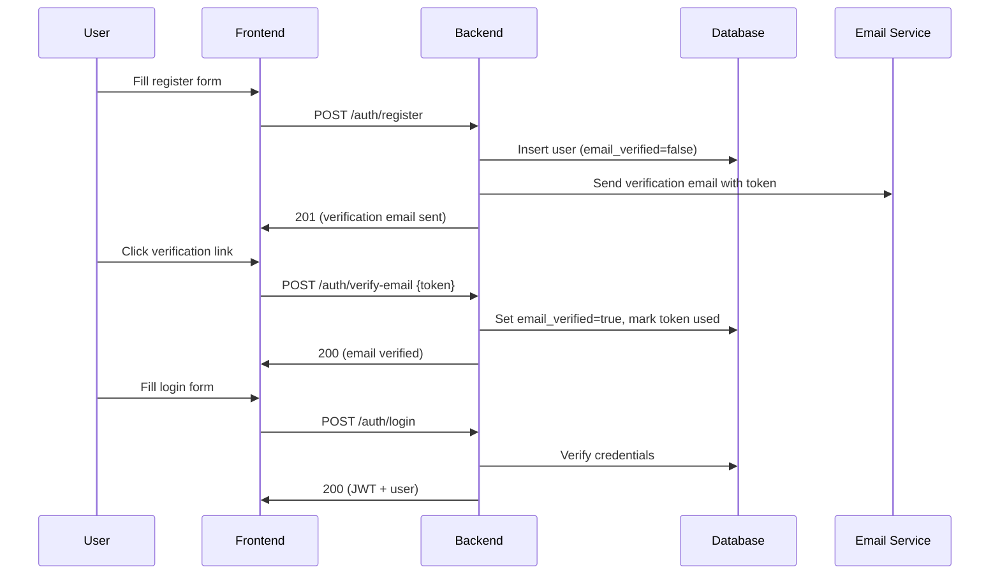
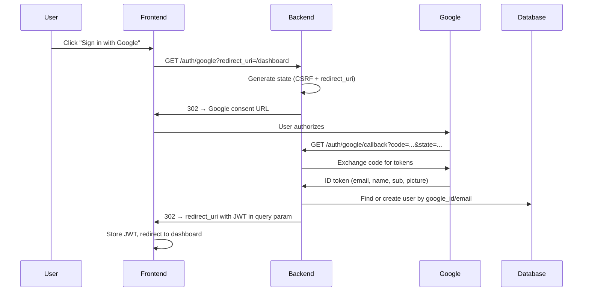
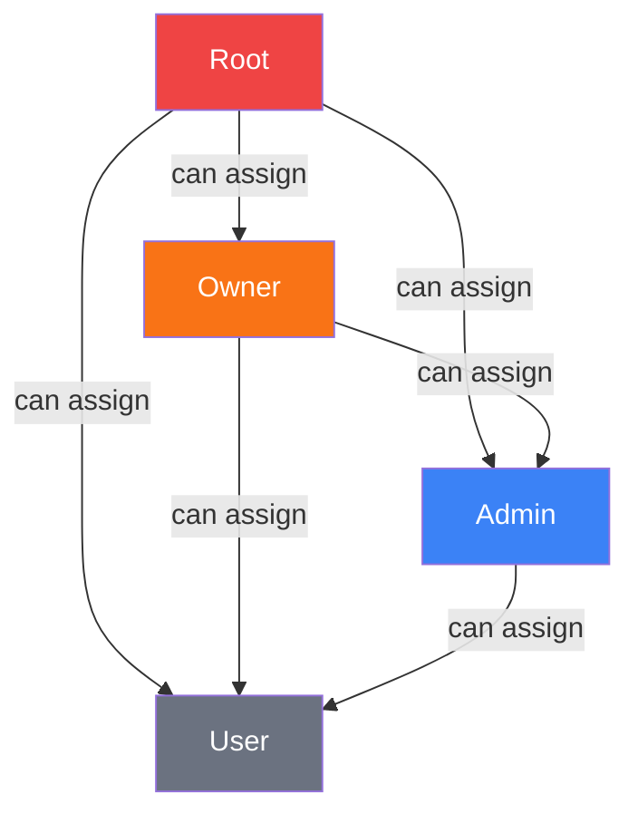

# Authentication & Authorization Specification

> Detailed auth flows, JWT structure, role enforcement, and security model for the Mailer Agent application.

---

## 1. Authentication Methods

### 1.1 Email + Password



**Password requirements:**
- Minimum 8 characters
- At least one uppercase, one lowercase, one digit
- Stored as bcrypt hash (cost factor 12)

**Email verification:**
- Token: 32-byte URL-safe random string (`secrets.token_urlsafe(32)`)
- Expiry: 24 hours
- Single-use: `used_at` is set on consumption
- Unverified users can log in but receive `403` on all protected endpoints

---

### 1.2 Google OAuth 2.0



**Google user creation rules:**
1. **New email** → create user with `provider=google`, `email_verified=true`, `google_id` set
2. **Existing email, no `google_id`** → link account: set `google_id`, keep existing `provider`
3. **Existing `google_id`** → log in as existing user

---

### 1.3 Account Linking (Email → Google)

A user who registered with email can link their Google account:

1. User is logged in (has valid JWT)
2. `POST /auth/link-google` → redirects to Google consent
3. Callback verifies the Google email matches the JWT user's email
4. Sets `google_id` on the user record
5. User can now log in via either method

> [!WARNING]
> If the Google account email differs from the registered email, the linking is rejected. Users cannot merge two different email identities.

---

## 2. JWT Token Structure

### 2.1 Token Payload

```json
{
  "sub": "user-uuid",
  "email": "user@example.com",
  "name": "Jane Doe",
  "global_role": "user",
  "email_verified": true,
  "iat": 1709251200,
  "exp": 1709337600
}
```

| Field | Description |
|---|---|
| `sub` | User UUID (primary identifier) |
| `email` | User email |
| `name` | Display name |
| `global_role` | System-wide role for quick authz checks |
| `email_verified` | Whether email is verified |
| `iat` | Issued at (Unix timestamp) |
| `exp` | Expiry (Unix timestamp) |

### 2.2 Token Configuration

| Property | Value |
|---|---|
| **Algorithm** | `HS256` |
| **Secret** | `JWT_SECRET` env var (min 32 chars) |
| **Access token TTL** | 24 hours |
| **Refresh token** | Not used (re-login required after expiry) |

> [!NOTE]
> `global_role` is embedded in the JWT for fast middleware checks without a DB query. If a user's role is changed, they must re-login to get a new token with the updated role.

---

## 3. Role System

### 3.1 Global Roles

| Role | Ordinal | Purpose |
|---|---|---|
| `user` | 0 | Default. Can use templates and draft mails |
| `admin` | 1 | Manage users, groups, and roles |
| `owner` | 2 | Create admins |
| `root` | 3 | Full system access. Set via DB seed only |

### 3.2 Group Roles

| Role | Ordinal | Purpose |
|---|---|---|
| `user` | 0 | Use templates, draft mails |
| `moderator` | 1 | Create templates, approve/send mails |
| `admin` | 2 | Manage group members and settings |
| `owner` | 3 | Full group control |
| `root` | 4 | System-level override |

### 3.3 Effective Role Computation

```python
def effective_group_role(user: User, group_id: UUID) -> GroupRole:
    """
    Effective role = MAX(explicit group role, global role).
    Global role acts as a FLOOR — elevated global users are never downgraded.
    """
    group_membership = get_user_group(user.id, group_id)

    # Global admin/owner/root map directly to group roles
    global_as_group = map_global_to_group(user.global_role)

    if group_membership is None:
        # Not a member, but global admin+ can still access
        if user.global_role >= GlobalRole.ADMIN:
            return global_as_group
        raise ForbiddenError("Not a member of this group")

    return max(group_membership.role, global_as_group)
```

**Global → Group role mapping:**

| Global Role | Maps To (Group) |
|---|---|
| `user` | `user` |
| `admin` | `admin` |
| `owner` | `owner` |
| `root` | `root` |

### 3.4 Role Assignment Rules



**Constraints:**
- A user can only assign roles **strictly below** their own effective role
- `root` role is **never assignable** via API — only via direct DB seed
- A user cannot change their own role
- Demoting a user requires the same privilege as assigning their current role

---

## 4. Authorization Matrix

### 4.1 Global Endpoints

| Endpoint | Minimum Role |
|---|---|
| `GET /users` | `admin` |
| `PATCH /users/{id}/role` | `admin` (target < own) |
| `POST /groups` | `admin` |

### 4.2 Group Endpoints

| Endpoint | Minimum Effective Group Role | Extra Constraints |
|---|---|---|
| `GET /groups/{id}` | `user` (member) | `admin+` can see any group |
| `PATCH /groups/{id}` | `admin` | |
| `DELETE /groups/{id}` | `owner` | |
| **Members** | | |
| `GET .../members` | `user` (member) | |
| `POST .../members` | `admin` | |
| `PATCH .../members/{id}` | `admin` | target role < own role |
| `DELETE .../members/{id}` | `admin` | |
| **Templates** | | |
| `POST .../templates` | `moderator` | moderators: own templates only |
| `DELETE .../templates/{id}` | `moderator` | |
| **Mails** | | |
| `POST .../mails/draft` | `user` | |
| `GET .../mails` | `user` | |
| `PATCH .../mails/{id}` | `user` | creator only, draft/rejected |
| `POST .../mails/{id}/submit` | `user` | creator only |
| `POST .../mails/{id}/approve` | `moderator` | not the creator |
| `POST .../mails/{id}/reject` | `moderator` | |
| `POST .../mails/{id}/send` | `moderator` | |
| **SMTP** | | |
| `PUT .../smtp` | `admin` | |
| `GET .../smtp` | `admin` | |
| `DELETE .../smtp` | `admin` | |

---

## 5. FastAPI Implementation Patterns

### 5.1 User Injection

```python
async def get_current_user(
    authorization: str = Header(...),
    db: AsyncSession = Depends(get_db),
) -> User:
    token = authorization.removeprefix("Bearer ")
    payload = jwt.decode(token, JWT_SECRET, algorithms=["HS256"])
    user = await db.get(User, payload["sub"])
    if not user or not user.is_active:
        raise HTTPException(401, "Invalid or inactive user")
    return user
```

### 5.2 Role Decorators

```python
def require_global_role(min_role: GlobalRole):
    def dependency(user: User = Depends(get_current_user)) -> User:
        if user.global_role < min_role:
            raise HTTPException(403, f"Requires global role >= {min_role.value}")
        return user
    return Depends(dependency)

def require_group_role(min_role: GroupRole):
    async def dependency(
        group_id: UUID,
        user: User = Depends(get_current_user),
        db: AsyncSession = Depends(get_db),
    ) -> User:
        effective = await compute_effective_group_role(user, group_id, db)
        if effective < min_role:
            raise HTTPException(403, f"Requires group role >= {min_role.value}")
        return user
    return Depends(dependency)
```

### 5.3 Verified Email Guard

```python
def require_verified_email(user: User = Depends(get_current_user)) -> User:
    if not user.email_verified:
        raise HTTPException(403, "Email verification required")
    return user
```

### 5.4 Endpoint Usage

```python
@router.post("/groups/{group_id}/mails/draft")
async def create_draft(
    group_id: UUID,
    body: CreateDraftRequest,
    user: User = require_group_role(GroupRole.USER),
    db: AsyncSession = Depends(get_db),
):
    ...

@router.post("/groups/{group_id}/mails/{mail_id}/approve")
async def approve_mail(
    group_id: UUID,
    mail_id: UUID,
    user: User = require_group_role(GroupRole.MODERATOR),
    db: AsyncSession = Depends(get_db),
):
    ...
```

---

## 6. Security Measures

| Concern | Mitigation |
|---|---|
| **CSRF on OAuth** | `state` param with HMAC-signed nonce |
| **JWT theft** | Short-lived tokens (24h), HTTPS only |
| **Password storage** | bcrypt with cost factor 12 |
| **Rate limiting** | Auth endpoints: 5 req/min per IP. LLM endpoints: 10 req/min per user |
| **Email enumeration** | Register/login return same error for wrong email/password |
| **Role escalation** | Server re-reads role from DB on sensitive operations, not just JWT |
| **CORS** | Whitelist frontend origin only |
| **Input validation** | Pydantic models validate all request bodies at boundary |
| **SQL injection** | SQLAlchemy ORM with parameterized queries |
| **SMTP credentials** | RSA-encrypted at rest, decrypted only at send time |
