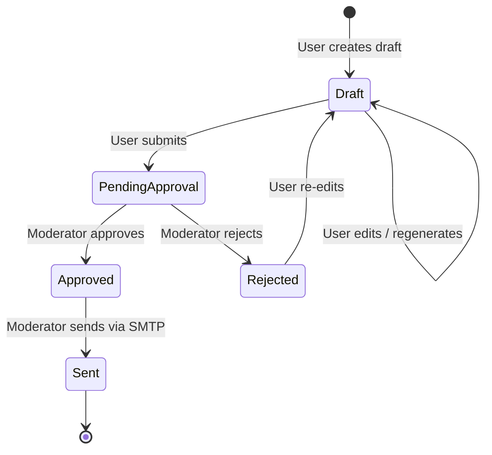
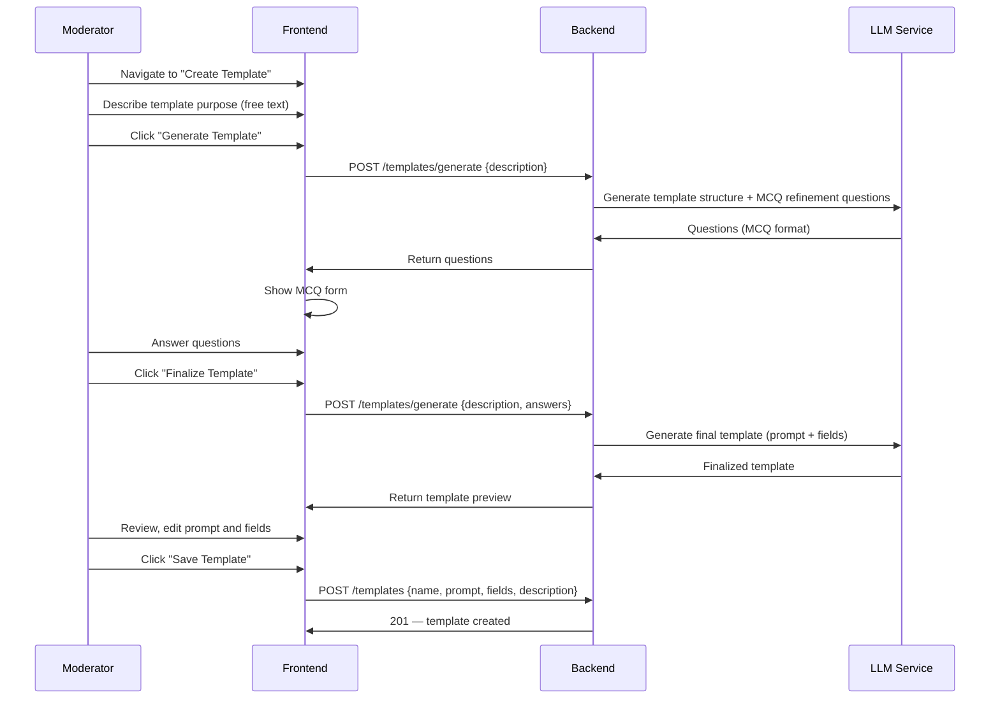
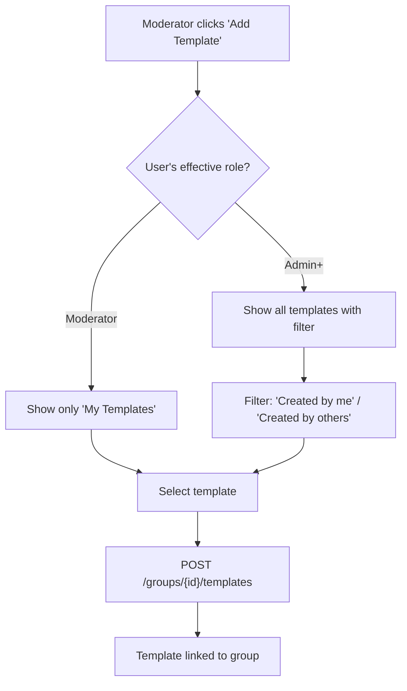
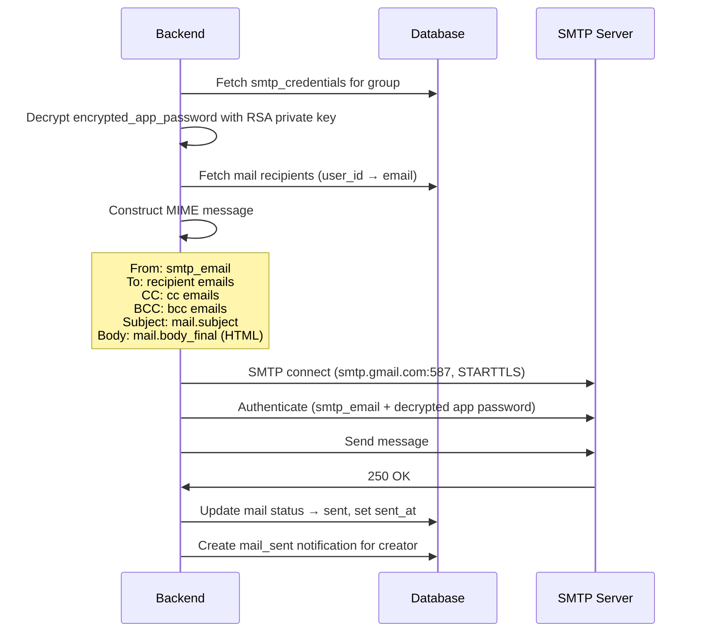
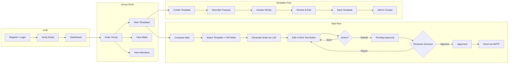

# Mail & Template Workflow

> Events, triggers, state machines, and end-to-end user flows for the Mailer Agent application.

---

## 1. Mail Lifecycle

### 1.1 State Machine



### 1.2 State Details

| State | Who Can Transition | Allowed Actions |
|---|---|---|
| `draft` | Creator | Edit body/subject/recipients, regenerate LLM draft, submit |
| `pending_approval` | Moderator+ (not creator) | Approve (optionally edit), reject with reason |
| `approved` | Moderator+ | Send via SMTP |
| `rejected` | Creator | Edit and re-submit (returns to `draft`) |
| `sent` | — | Terminal state, read-only |

---

## 2. Mail Creation Flow

### 2.1 End-to-End Sequence

```mermaid
sequenceDiagram
    participant U as User
    participant F as Frontend
    participant B as Backend
    participant LLM as LLM Service
    participant DB as Database

    U->>F: Navigate to "Compose Mail"
    F->>B: GET /groups/{id}/templates (fetch available)
    B->>F: Template list
    U->>F: Select template, fill fields, add recipients
    U->>F: Click "Generate Draft"
    F->>B: POST /groups/{id}/mails/draft
    B->>B: Validate fields against template schema
    B->>LLM: Send prompt + filled fields + additional info
    LLM->>B: Generated email body
    B->>DB: Insert mail (status=draft, body_original=body_final=LLM output)
    B->>F: 201 — draft with body_original + body_final
    F->>F: Reveal split pane (fields left, editor right)
    Note over F: Editor loads body_final, body_original stored for diff

    rect rgb(45, 45, 57)
        Note over U,F: Editing & Diff Phase
        U->>F: Edit body in rich text editor
        F->>F: Compute live diff (body_original vs editor content)
        F->>F: Display inline diffs (green=added, red=removed)
        U->>F: Click "Save Draft"
        F->>B: PATCH .../mails/{id} {body_final: edited text}
        B->>DB: Update body_final (body_original unchanged)
        B->>F: 200 — draft saved with diffs preserved
    end

    U->>F: Click "Submit for Approval"
    F->>B: POST /groups/{id}/mails/{id}/submit
    B->>DB: Update status → pending_approval
    B->>B: Trigger notifications
    B->>F: 200 — submitted
```



### 2.2 LLM Prompt Construction

The backend constructs the LLM prompt by combining:

```
[System instructions — tone, format, length guidelines]

Template prompt: "{template.prompt}"

Field values:
- {field.label}: {value}
- {field.label}: {value}
...

Additional context from user: "{additional_info}"

Generate a professional email with subject: "{subject}"
```

### 2.3 Regeneration

When the user clicks "Regenerate":

1. Backend re-calls LLM with current field values (which may have changed)
2. `body_original` is overwritten with new LLM output
3. `body_final` is reset to match `body_original`
4. Previously user-edited diffs are lost (user is warned via confirmation dialog)

---

## 3. Approval Flow

### 3.1 Sequence

```mermaid
sequenceDiagram
    participant C as Creator
    participant F as Frontend
    participant B as Backend
    participant M as Moderator
    participant DB as Database
    participant E as Email (SMTP)

    C->>B: POST .../mails/{id}/submit
    B->>DB: status → pending_approval
    B->>DB: Create notifications for group moderators + admins
    B->>F: Push notification (or poll)
    M->>F: Open mail review page
    F->>B: GET .../mails/{id}
    B->>F: Mail with body_original + body_final

    rect rgb(45, 45, 57)
        Note over M,F: Diff Review Phase
        F->>F: Compute diff (body_original vs body_final)
        F->>F: Display inline diffs (green=added, red=removed)
        Note over M: Reviewer sees what creator changed from LLM output
        M->>F: Optionally edit body_final in editor
        F->>F: Update live diff (body_original vs reviewer edits)
    end

    alt Approve
        M->>B: POST .../mails/{id}/approve {body_final}
        B->>DB: Update body_final with reviewer version
        B->>DB: status → approved, set approved_by + approved_at
        Note over B,DB: body_original preserved for audit trail
        B->>DB: Notify creator (mail_approved)
    else Reject
        M->>B: POST .../mails/{id}/reject {reason}
        B->>DB: status → rejected
        B->>DB: Notify creator (mail_rejected, include reason)
        Note over C: Creator can re-edit diffs and resubmit
    end

    alt Send (after approval)
        M->>B: POST .../mails/{id}/send
        B->>DB: Fetch SMTP credentials for group
        B->>B: Decrypt app password with RSA private key
        B->>E: Send email via SMTP (uses body_final)
        B->>DB: status → sent, set sent_at
        B->>DB: Notify creator (mail_sent)
    end
```



### 3.2 Reviewer Edit Rules

- Reviewer can edit `body_final` before approving
- Reviewer edits are tracked — `approved_by` records who made the final version
- Both `body_original` (LLM output) and `body_final` (final approved version) are preserved

---

## 4. Template Creation Flow

### 4.1 Sequence



### 4.2 Template Structure Generation

The LLM generates:

1. **Prompt text** — the instruction template with `{{field}}` placeholders
2. **Field definitions** — array of fields with key, label, type, required, options
3. **Description** — auto-generated summary of the template's purpose

The moderator reviews and can:
- Edit the prompt text directly
- Add, remove, or reorder fields
- Change field types and options
- Modify the description

### 4.3 Adding Templates to Groups



---

## 5. SMTP Send Flow

### 5.1 Sequence



### 5.2 Error Handling

| Error | Action |
|---|---|
| SMTP credentials not configured | Return `400` — "SMTP not configured for this group" |
| Decryption failure | Return `500` — log error, do not expose details |
| SMTP auth failure | Return `502` — "SMTP authentication failed, check credentials" |
| Send failure (timeout, reject) | Return `502` — preserve `approved` status, allow retry |
| Partial delivery failure | Log per-recipient errors, status remains `sent` if at least one succeeded |

---

## 6. Notification System

### 6.1 Events & Triggers

| Event | Trigger | Recipients | Notification Type |
|---|---|---|---|
| Mail submitted for approval | `POST .../submit` | All moderators + admins in the group | `approval_requested` |
| Mail approved | `POST .../approve` | Mail creator | `mail_approved` |
| Mail rejected | `POST .../reject` | Mail creator | `mail_rejected` |
| Mail sent | `POST .../send` | Mail creator | `mail_sent` |
| User added to group | `POST .../members` | Added user | `added_to_group` |
| User removed from group | `DELETE .../members/{id}` | Removed user | `removed_from_group` |
| User role changed | `PATCH .../members/{id}` | Affected user | `role_changed` |

### 6.2 Notification Delivery

Notifications are stored in the `notifications` table. The frontend retrieves them via:

1. **Polling** — `GET /notifications?unread_only=true` every 30 seconds
2. **On page load** — fetch unread count for the bell badge

> [!NOTE]
> WebSocket-based real-time delivery can be added later as an enhancement. The initial implementation uses polling.

### 6.3 Notification Content Templates

| Type | Title | Message |
|---|---|---|
| `approval_requested` | "Mail awaiting approval" | "{creator.name} submitted '{mail.subject}' in {group.name}" |
| `mail_approved` | "Mail approved" | "{approver.name} approved '{mail.subject}'" |
| `mail_rejected` | "Mail needs revision" | "{reviewer.name} rejected '{mail.subject}': {reason}" |
| `mail_sent` | "Mail sent" | "'{mail.subject}' was sent to {recipient_count} recipients" |
| `added_to_group` | "Added to group" | "You were added to {group.name}" |
| `removed_from_group` | "Removed from group" | "You were removed from {group.name}" |
| `role_changed` | "Role updated" | "Your role in {group.name} was changed to {new_role}" |

---

## 7. Diff Tracking

### 7.1 How Diffs Work

| Field | Purpose |
|---|---|
| `body_original` | LLM-generated text. Updated only on regeneration |
| `body_final` | User/reviewer-edited text. Updated on every save |

The frontend computes and displays diffs client-side by comparing `body_original` and `body_final` using a diff library (e.g., `diff-match-patch` or `jsdiff`).

### 7.2 Diff Display Rules

| Context | Diff Shown |
|---|---|
| Creator editing | `body_original` vs current editor content (live) |
| Reviewer viewing | `body_original` vs `body_final` (submitted version) |
| Reviewer editing | `body_original` vs current editor content (live) |
| Sent mail view | `body_original` vs `body_final` (final version, read-only) |

---

## 8. User Flow Summary


